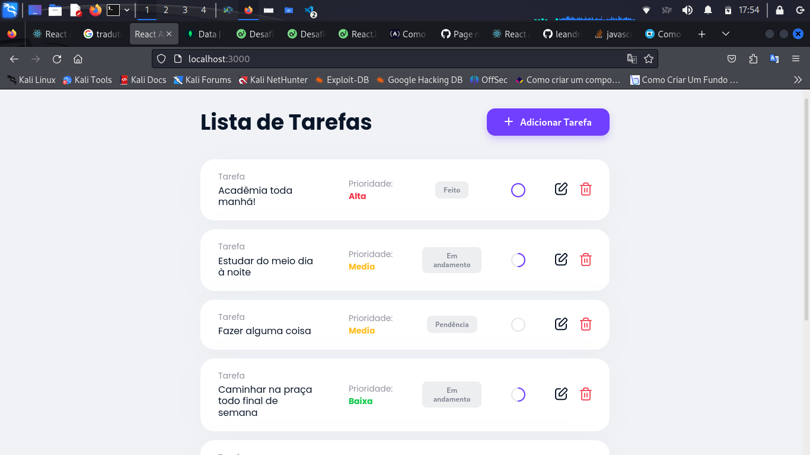

### Primeiros passos com o aplicativo Task-List

Este projeto foi inicializado com [Create React App](https://github.com/facebook/create-react-app).

### Scripts Disponíveis

No diretório do projeto, você pode executar:

### `npm start`

Aplicativo Frontend desenvolvido em React sobre Lista de Tarefas que permite a interação com o backend por meio das operações "CRUD", a imagem de sua tela inicial pode ser vista acima!

## Contato:
| Integrante | Usuário Git | E-mail para contato |
| --- | --- | --- |
| Leandro Lobo | [@LeandroLobo](https://github.com/bigolho16) | bigolho900@gmail.com |
